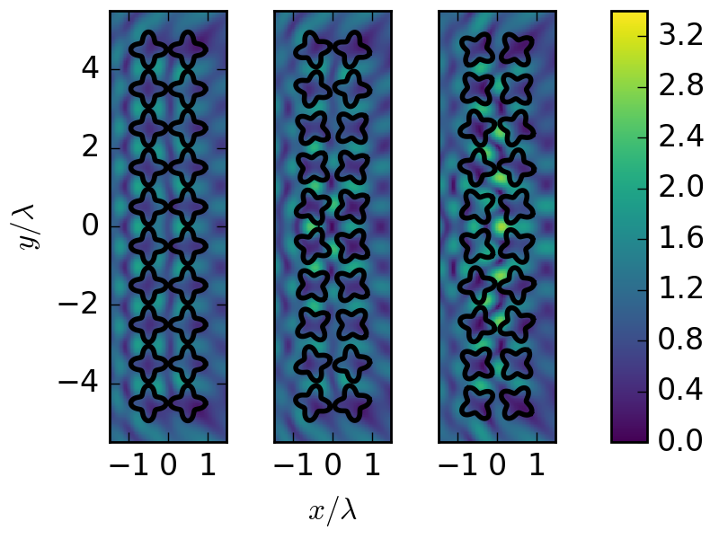

# Summary

[ParticleScattering](https://github.com/bblankrot/ParticleScattering.jl) is a Julia package for computing the electromagnetic fields scattered by a large number of two-dimensional particles, as well as optimizing particle parameters for various applications.
Such problems naturally arise in the design and analysis of metamaterials, including photonic crystals [@ar:alldielectric].
Unlike most solvers for these problems, ours does not require a periodic structure and is scalable to a large number of particles.
In particular, this software is designed for scattering problems involving TM plane waves impinging on a collection of homogeneous dielectric particles with arbitrary smooth shapes.
Our code performs especially well when the number of particles is substantially larger than the number of distinct shapes, where particles are considered indistinct if they are identical up to rotation.

## Solver overview
Given a scattering problem consisting of a collection of penetrable particles in a homogeneous medium, the software performs the following steps to calculate the total electric field:

- For each distinct non-circular shape, a single- and double-layer potential formulation is constructed.
- The potential formulations are transformed to a multipole basis of Hankel functions, reducing the degrees of freedom by at least an order of magnitude.
- Analytical multipole basis is computed for circular particles.
- A multiple-scattering system of equations is constructed, and then solved with the Fast Multipole Method.
- Electric field is computed at any point of interest.

In addition, ParticleScattering can plot near- and far-field results using the popular framework [PyPlot](https://github.com/JuliaPy/PyPlot.jl), create publication-level plots with [PGFPlots](https://github.com/KristofferC/PGFPlotsX.jl) integration, and compute minimum parameters for a desired error level.

## Optimization

ParticleScattering is especially targeted at users who wish to design metamaterials belonging to the class described above.
While the large number of variables such metamaterials contain allows for a variety of devices that meet different objectives, it also creates a large search space for choosing them. Therefore, a fast and automated approach can be beneficial for both inventing new designs and improving existing ones.
As the results of many ParticleScattering computations can be recycled between optimization iterations, a large number of parameters can be optimized simultaneously in reasonable time.
ParticleScattering performs gradient-based optimization of rotation angle for arbitrarily-shaped particles, and radius of circular particles, in conjunction with the Optim optimization package [@ar:optimjl], where the objective is to minimize or maximize the electric field intensity at chosen points.
Figure 1 shows an example of angle optimization of 20 particles, where the objective is the electric field intensity at the origin. From left to right, we see the electric field before optimization, after minimization, and after maximization. The field intensity at the origin is clearly different in both optimization results, with minimization decreasing the intensity by 95%, and maximization increasing it by over 700%. The total run time for both optimizations and all necessary precomputations was 35 seconds.

For a detailed description of our approach, including several numerical examples generated by ParticleScattering, see our recent publication [@ar:blankrot2018].

# Acknowledgments

This work was supported by the Austrian Science Fund (FWF) through the START Project Y 660 *PDE Models for Nanotechnology*.

# References
